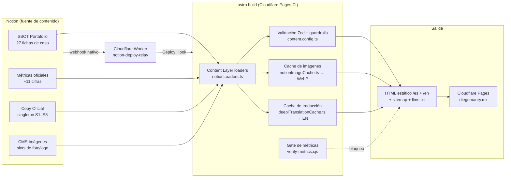

# notion-cms

Cómo está armado el CMS que alimenta **[diegomaury.mx](https://diegomaury.mx)**: un portafolio en Astro cuyo contenido —casos, copy, métricas e imágenes— vive en Notion y se compila a HTML estático en cada build, con auto-publicación desde Notion vía un Cloudflare Worker.

Este repo es una **vitrina de arquitectura**: documentación + extractos de código reales para entender el sistema sin acceso al repo del sitio. No es un paquete instalable ni la fuente de verdad del código.

Los archivos de [`reference-code/`](reference-code/) son **artefactos generados**: se regeneran con `npm run sync:notion-cms` desde `newlandingpage` y no se editan a mano aquí. El commit y los hashes exactos viven en [`reference-code/MANIFEST.json`](reference-code/MANIFEST.json). Automatizar esa sincronización (GitHub Action que abra PR) es un paso futuro opcional, no implementado.

- **Snapshot anclado a:** `newlandingpage@2f5fb0c` (2026-08-31)
- **Fuente viva del código:** repo privado `diegomaury-mx/newlandingpage` (`src/services/`, `src/content.config.ts`)
- **Fuente viva del contenido:** workspace de Notion de Diego Maury
- **Sitio en producción:** https://diegomaury.mx · **auto-deploy:** Cloudflare Pages (Git integration, rama `master`)

---

## El sistema en una imagen

---

## Índice de la documentación

| # | Documento | Qué cubre |
|---|-----------|-----------|
| 01 | [Arquitectura](docs/01-architecture.md) | Flujo de datos completo, componentes, por qué build-time y no runtime |
| 02 | [Contrato de datos Notion → Astro](docs/02-notion-data-contract.md) | Las 4 fuentes, mapeo propiedad→schema, reglas de publicación |
| 03 | [Pipeline de imágenes](docs/03-image-pipeline.md) | URLs S3 que expiran, descarga + recompresión WebP, versionado en git |
| 04 | [Pipeline de traducción](docs/04-translation-pipeline.md) | DeepL en build, cache por hash, cola de rate-limit, degradación |
| 05 | [Gates de build](docs/05-build-gates.md) | Guardrail Insignia (`superRefine`), gate `Publicable`, verificador de métricas |
| 06 | [Auto-publicación](docs/06-auto-publish.md) | El Worker `notion-deploy-relay`, webhook de Notion, Deploy Hook, HMAC |
| 07 | [Runbook](docs/07-runbook.md) | Fallos conocidos y cómo diagnosticarlos |
| 08 | [Límites y deuda técnica](docs/08-limitations.md) | Qué está sin resolver y por qué, riesgos aceptados |

## Extractos de código

En [`reference-code/`](reference-code/) están los archivos reales del pipeline, copiados verbatim del commit ancla (ya vienen comentados en el original):

| Archivo | Rol |
|---|---|
| `notionClient.ts` | Cliente de lectura de Notion + helpers de extracción de propiedades |
| `notionLoaders.ts` | Loaders de Astro Content Layer: mapean Notion → shape de colección |
| `content.config.ts` | Schemas Zod de las 4 colecciones + guardrails de publicación |
| `notionImageCache.ts` | Descarga y recomprime imágenes de Notion en build |
| `deeplTranslationCache.ts` | Traduce y cachea prosa para la versión `/en/*` |
| `env.ts` | Lectura unificada de variables de entorno |
| `verify-metrics.cjs` | Verificador bloqueante del SSOT de métricas |
| `notion-deploy-relay.worker.js` | Cloudflare Worker de auto-publicación (vive fuera de `newlandingpage`) |

## Stack

- **Astro 7** (`output: 'static'`), Content Layer API con `loader:` personalizados
- **@notionhq/client 5** — API de Notion, integración de solo lectura
- **sharp** — recompresión de imágenes a WebP en build
- **DeepL API** (plan Free) — traducción ES→EN en build
- **Zod** (vía `astro:content`) — validación de contenido, fallo en frío
- **Cloudflare Pages** — hosting + CI (build en cada push a `master`)
- **Cloudflare Workers + KV** — relay de webhooks Notion → Deploy Hook

## Decisiones de diseño, en corto

- **Todo el contenido se resuelve en build, nada en runtime.** El sitio servido es HTML plano; Notion no se consulta cuando un visitante entra. Consecuencia: un cambio en Notion necesita un rebuild (de ahí el Worker).
- **El build falla en frío ante contenido no verificable.** Una ficha Insignia publicada sin métrica ancla + evidencia rompe el build; el sitio anterior sigue vivo. Nunca se publica una cifra a medias.
- **Las URLs de archivos de Notion nunca llegan al HTML.** Son firmas S3 que expiran en ~1h; se descargan y se sirven como asset propio.
- **La traducción degrada con gracia.** Sin `DEEPL_API_KEY`, `/en/*` se sirve en español en vez de romper.
- **Doble gate de publicación:** `Estado publicación = Publicado` **y** checkbox `Publicable`. Ver [05](docs/05-build-gates.md).
