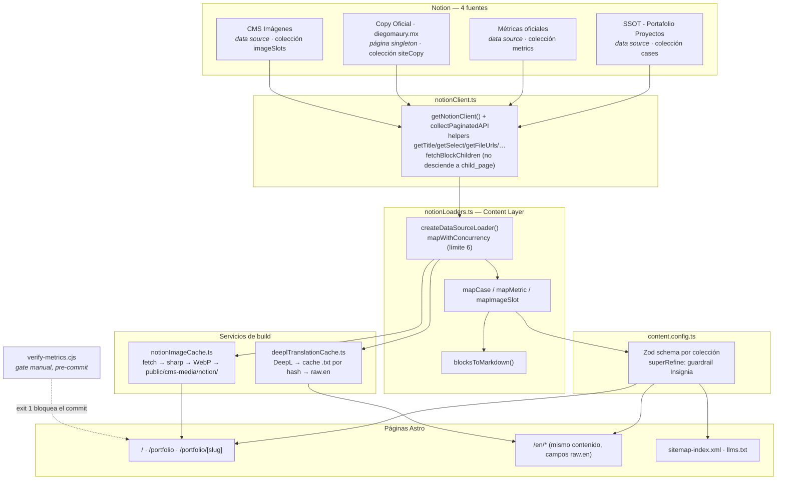

# 01 · Arquitectura

## Tesis

El contenido editorial de `diegomaury.mx` (casos de portafolio, copy del home, cifras públicas, algunas imágenes) vive en **Notion**, no en el repo. Un build de **Astro** lo lee, lo valida y lo compila a **HTML estático**. **Cloudflare Pages** hostea el resultado y reconstruye en cada push a `master`. Un **Cloudflare Worker** permite que un cambio hecho solo en Notion también dispare ese rebuild.

No hay base de datos propia, ni API en runtime, ni CMS headless de terceros: Notion *es* el CMS, y el "pipeline" es un conjunto de loaders que corren durante `astro build`.

## Diagrama de componentes

## Las cuatro colecciones

| Colección | Fuente Notion | Forma | Alimenta |
|---|---|---|---|
| `cases` | `SSOT - Portafolio Proyectos` (`88257bc9-…`) | data source, 27 fichas | `/portfolio`, `/portfolio/[slug]` y sus equivalentes `/en/*` |
| `metrics` | `Métricas oficiales — Portafolio D` (`213ea2d0-…`) | data source, ~11 filas | resolución de cifras en casos y home, `llms.txt` |
| `siteCopy` | `Copy Oficial · diegomaury.mx (SSOT)` (`d9ab8508-…`) | **página única**, no database | todo el texto de `/` (S1–S8) y bloques `P1–P5` de `/portfolio` |
| `imageSlots` | `🖼️ CMS Imágenes — Portafolio D` (`8dda9726-…`) | data source | foto de Diego y cinturón de logos del home |

Detalle campo por campo: [02 · Contrato de datos](02-notion-data-contract.md).

## Anatomía de un loader

Todos los loaders de data source se construyen con la misma fábrica, `createDataSourceLoader(name, fetchFn, mapFn, idFn, imageFields, translatableFields)` (`notionLoaders.ts`). Por cada fuente:

1. **`store.clear()`** — el loader es idempotente, reconstruye desde cero.
2. **Gate de token** — sin `NOTION_TOKEN`: si `import.meta.env.PROD`, lanza y aborta el build; si es dev, deja la colección vacía y sigue (permite generar tipos sin credenciales).
3. **`fetchFn()`** — `collectPaginatedAPI(notion.dataSources.query, …)` trae todas las páginas.
4. **`mapWithConcurrency(pages, 6, …)`** — procesa hasta 6 fichas en paralelo. Cada ficha:
   - `mapFn(page)` — extrae propiedades con los helpers de `notionClient.ts`; para `cases`, además `fetchBlockChildren(page.id)` + `blocksToMarkdown()` para el cuerpo.
   - por cada campo en `imageFields` (`banner`, `logo`, `evidenceMedia`, `imageUrl`): `cacheNotionImage(url, key)` reemplaza la URL de Notion por una ruta local.
   - si hay `translatableFields`: `translateFields(raw, fields)` llena `raw.en` con las traducciones DeepL cacheadas.
   - `parseData({ id, data: raw })` — **aplica el schema Zod**; un dato inválido lanza y detiene el build.
   - `store.set({ id, data })`.

`siteCopy` no usa la fábrica: es un singleton (`id: "site"`) cuyo cuerpo entero se aplana a un solo string Markdown y se parsea *después*, en runtime de las páginas, con `src/utils/parseSiteCopy.ts` (no en Zod).

## Por qué build-time y no runtime

- **Costo y latencia:** la API de Notion es lenta (traer las 27 fichas con su cuerpo completo toma 90–115s). Hacerlo por visita sería inviable.
- **Verificabilidad:** el build es el único punto donde se puede *bloquear* la publicación de contenido no verificado (ver [05](05-build-gates.md)). En runtime solo quedaría degradar.
- **Resiliencia:** si Notion está caído, el sitio ya desplegado sigue sirviéndose. Un build fallido no tumba producción.
- **Hosting trivial:** HTML plano en un CDN, sin servidor.

El precio es la **latencia de publicación**: un cambio en Notion no se ve hasta que hay un rebuild. Lo resuelve el Worker de [auto-publicación](06-auto-publish.md).

## Entornos y secretos

| Secreto | Dónde vive | Para qué |
|---|---|---|
| `NOTION_TOKEN` | secret de Cloudflare Pages (`production` **y** `preview` por separado) + `.env` local + secret de GitHub para CI | integración de solo lectura de Notion |
| `DEEPL_API_KEY` | secret de Cloudflare Pages + `.env` local | traducción ES→EN en build (opcional: sin ella, `/en` cae a español) |
| `NOTION_WEBHOOK_SECRET` | secret del Worker | validar la firma HMAC del webhook de Notion |
| `DEPLOY_HOOK_URL` | secret del Worker | Deploy Hook de Cloudflare Pages que dispara el rebuild |

`readEnvVar()` (`env.ts`) unifica el acceso: prueba `process.env` primero (scripts standalone / CI) y cae a `import.meta.env` (inyección de Vite en código server-side de Astro).

**Gotcha de entornos:** los secrets de Cloudflare Pages se configuran por separado para `preview` y `production`. Un check de PR ("Cloudflare Pages") puede fallar con `API token is invalid` porque el `NOTION_TOKEN` de `preview` está vacío, aunque `production` esté sano y build correctamente. Antes de bloquear un merge, verificar que `master` esté desplegando bien en ese momento.
