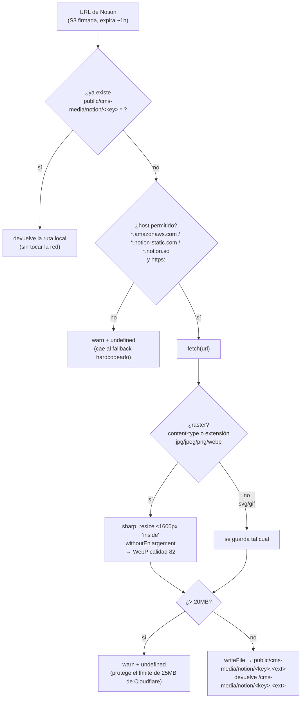

# 03 · Pipeline de imágenes

Fuente: `reference-code/notionImageCache.ts`.

## El problema

La API de Notion devuelve las imágenes de archivos subidos como **URLs firmadas de S3**: `https://prod-files-secure.s3.…?X-Amz-Expires=3600&…`. Esa firma expira en ~1 hora.

Cloudflare Pages solo reconstruye el sitio **en cada push** (no hay rebuild diario). Si el HTML generado apuntara a la URL firmada, la firma expiraría antes de la siguiente visita y **la imagen se rompería en producción** aunque el sitio siguiera vivo. Pasó de verdad; también fue la causa de un LCP de 15.6s cuando las imágenes se servían a tamaño completo.

## La solución

`cacheNotionImage(url, cacheKey, logger)` corre en build, dentro de cada loader, por cada campo listado en `imageFields` (`banner`, `logo`, `evidenceMedia` para `cases`; `imageUrl` para `imageSlots`). Devuelve una **ruta local** (`/cms-media/notion/<cacheKey>.webp`) que reemplaza a la URL de Notion antes de guardarse en el store.

## Detalles que importan

- **Cache-hit primero.** `findCachedFile()` hace `readdir` del directorio de cache y busca un archivo que empiece con `<cacheKey>.` — si existe, devuelve la ruta sin pegarle a la red. `cacheKey` es `${loaderName}-${entryId}-${field}` (más `-${index}` para arrays).
- **Recompresión con `sharp`.** Todo raster se redimensiona a máx. 1600px de lado (`fit: "inside"`, `withoutEnlargement: true`) y se reencoda a WebP calidad 82. Bajó el cache completo de Notion de ~38MB a ~4.4MB. SVG y GIF no se tocan. Si `sharp` falla, se guarda el original con un warning.
- **Allowlist de host.** `isAllowedImageUrl()` exige `https:` y hostname que termine en `.amazonaws.com`, `.notion-static.com` o `.notion.so`. El trust model es single-editor, pero es defensa en profundidad barata contra SSRF.
- **Límite de tamaño.** Cloudflare Pages rechaza assets estáticos > 25MB. El margen de 20MB descarta un archivo pesado con warning en vez de romper el deploy completo.
- **Degradación.** Si cualquier paso falla, el campo queda `undefined` y el render cae al path hardcodeado (`slotSrc` / plantillas de caso). El build no se rompe.

## Persistencia del cache en git

`public/cms-media/notion/` **se versiona en git** (el `.gitignore` del repo del sitio tiene `!public/cms-media/notion/`). Motivo: Cloudflare Pages clona el repo limpio en cada build; si el cache estuviera gitignored, cada deploy recomprimiría **todo desde cero**. Con el cache versionado, solo las imágenes genuinamente nuevas o cambiadas gastan trabajo en el siguiente build.

Consecuencia operativa: correr `astro build` local deja archivos `.webp`/`.gif` nuevos en esa carpeta como cambios sin commitear. Hay que decidir si se commitean o se descartan antes de cerrar.

> **Deuda conocida:** el cache-hit por `readdir` mitiga pero no elimina el costo; ver [08 · Límites](08-limitations.md).
