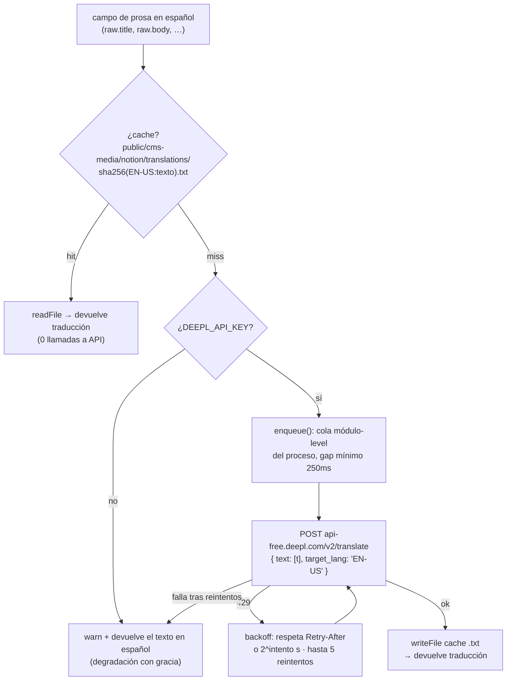

# 04 · Pipeline de traducción (ES → EN)

Fuente: `reference-code/deeplTranslationCache.ts` + `translateFields()` en `notionLoaders.ts`.

El sitio es bilingüe desde 2026-08-17: ES es el locale default sin prefijo (`/`, `/portfolio`), EN vive bajo `/en/*`. El contenido dinámico (casos, métricas) se traduce **automáticamente con la API de DeepL en build time**, nunca a mano.

## Cómo fluye

Los campos traducidos se guardan en `raw.en.<campo>` (schema `translatableEnSchema` en `content.config.ts`, construido con las **mismas** listas `CASE_TRANSLATABLE_FIELDS` / `METRIC_TRANSLATABLE_FIELDS` que usa el loader — una sola fuente de verdad). Cada página `/en/*` cae a `entry.data.en.campo || entry.data.campo` como fallback.

## Decisiones y gotchas

- **`translateFields` paraleliza los campos** (`Promise.all`). Un cache-hit es solo una lectura de disco; la serialización real del rate-limit la hace la cola módulo-level, no importa cuántos campos pidan traducción a la vez.
- **La cola es módulo-level a propósito.** Un build de Astro es un solo proceso Node, así que `requestQueue` encadena de verdad *todo* el tráfico a DeepL de ese build, con `DEFAULT_MIN_GAP_MS = 250` entre el fin de una llamada y el inicio de la siguiente. Sin esto, un build completo dispara ~300 llamadas casi simultáneas y el plan Free las rechaza en ráfaga (incidente 2026-08-17).
- **Nunca `tag_handling: "xml"`.** El texto es prosa/markdown plano, no XML válido. Ese parámetro le pide a DeepL parsear como XML; cualquier `<`, `>` o `&` suelto devuelve HTTP 400 sin reintento posible (se perdió toda la traducción de S6/S8 del home en el primer build real).
- **La home ES no se traduce sobre su markdown crudo.** `parseSiteCopy.ts` + los matches literales en `index.astro` dependen de texto exacto en español; traducir el bloque `siteCopy` completo antes de parsearlo rompería esos matches en silencio. `src/pages/en/index.astro` corre el **mismo parseo ES sin modificar** y traduce cada string ya extraído a nivel de hoja.

## El incidente de cuota (2026-08-17, resuelto)

El cache de traducción estaba gitignored. Cloudflare Pages clona el repo limpio en cada build → el cache **no persistía entre deploys** → cada push que tocara contenido `/en/*` retraducía el sitio completo (~300+ llamadas). Una tarde de pruebas agotó la cuota mensual gratuita de DeepL (500,000 caracteres).

**Fix:** `public/cms-media/notion/translations/*.txt` **se versiona en git**. El cache sobrevive entre deploys; solo el contenido genuinamente nuevo gasta cuota.

**Diagnóstico:** `GET https://api-free.deepl.com/v2/usage` con el mismo `DEEPL_API_KEY` (no consume cuota). Sin cuota disponible, todo texto nuevo degrada a español con gracia hasta el reset del próximo mes.

## Textos que NO pasan por DeepL

Los textos fijos de UI que el código escribe literal (nav, botones, labels) viven en `src/i18n/ui.ts` (`uiEn`), traducidos a mano — son strings cortos y estables.
