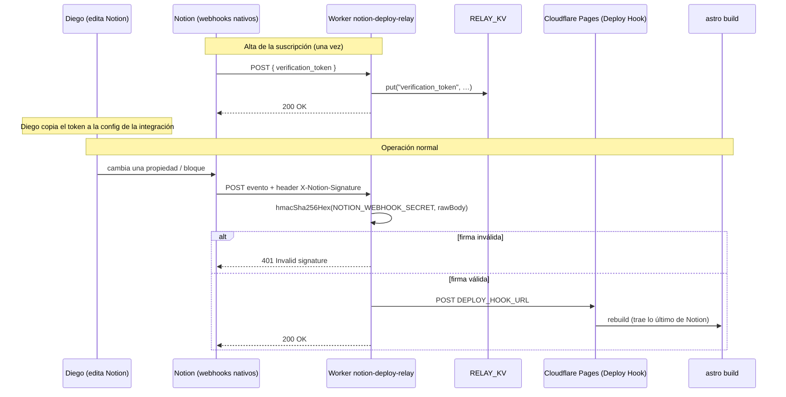

# 06 · Auto-publicación (Notion → rebuild sin push)

Fuente: `reference-code/notion-deploy-relay.worker.js`.

## El problema

Todo el contenido se resuelve en build (ver [01](01-architecture.md)). Un cambio hecho **solo en Notion** —corregir una cifra, reemplazar una foto, editar el copy del hero— no se ve en el sitio hasta que alguien dispara un rebuild. Antes de agosto 2026 eso era manual (pedir un push trivial, o correr un workflow a mano).

## La solución

Un Cloudflare Worker, **`notion-deploy-relay`**, desplegado en la cuenta `Diegoraul.maury@gmail.com's Account`, en `https://notion-deploy-relay.diegoraul-maury.workers.dev`.

### Qué hace el Worker, paso a paso

1. Rechaza todo lo que no sea `POST` (405).
2. Si el body trae `verification_token` (handshake inicial de Notion): lo guarda en KV y responde 200. Sin firma todavía.
3. Si no hay header `X-Notion-Signature`: 400.
4. Si `NOTION_WEBHOOK_SECRET` no está configurado: 503.
5. Calcula `HMAC-SHA256(secret, rawBody)` con `crypto.subtle` y compara `"sha256=" + hex` contra el header. No coincide → 401.
6. Firma válida → `fetch(DEPLOY_HOOK_URL, { method: "POST" })` → 200.

**Una sola llamada al Deploy Hook por request.** No hay loop ni doble llamada (confirmado en el código).

## Suscripción de Notion

El Worker recibe la suscripción nativa de webhooks de Notion sobre las **3 fuentes editables** del CMS: SSOT casos, CMS Imágenes, Copy Oficial. (`Métricas oficiales` alimenta vía el espejo `metrics.json`, no directamente.)

### Gotcha crítico · versión de API de la integración

Los tipos de evento que Notion emite por webhook dependen de la **versión de API configurada en la integración** (Settings & members → Connections → integración → API version), no de un header por-request (los webhooks salientes no lo llevan).

Con una versión vieja, los cambios en propiedades tipo archivo (reemplazar una imagen) **no disparaban ningún evento** — el auto-publish se quedaba "colgado" en silencio ante ese tipo de edición, sin que nada estuviera roto en el Worker. Fijo en `2026-03-11` con todos los eventos habilitados.

**Si un cambio en Notion no dispara rebuild:** revisar primero la versión de API de la integración, antes de asumir que el Worker o el Deploy Hook están rotos.

## Gotcha · ráfagas de builds

Notion emite un evento de webhook **independiente por cada propiedad/bloque** que cambia en una sola edición. Una edición grande dispara 3–4 builds casi simultáneos. No es un bug: es el volumen esperado de los eventos habilitados.

## Gotcha · deploy hooks duplicados

El proyecto de Cloudflare Pages llegó a tener dos deploy hooks ("Diego CMS" huérfano y "notion-cms-rebuild"). El Worker solo llama a `env.DEPLOY_HOOK_URL` una vez, así que el segundo hook no causaba builds duplicados por sí mismo. El secret se re-apuntó explícitamente a "notion-cms-rebuild" para eliminar la ambigüedad (Cloudflare nunca deja releer el valor de un secret guardado).

## Secrets y bindings del Worker

| Nombre | Tipo | Para qué |
|---|---|---|
| `NOTION_WEBHOOK_SECRET` | secret | validar la firma HMAC del webhook |
| `DEPLOY_HOOK_URL` | secret | Deploy Hook de Cloudflare Pages (`newlandingpage`, → "notion-cms-rebuild") |
| `RELAY_KV` | KV namespace | guardar el `verification_token` del handshake |

Ninguno vive en un repo.
